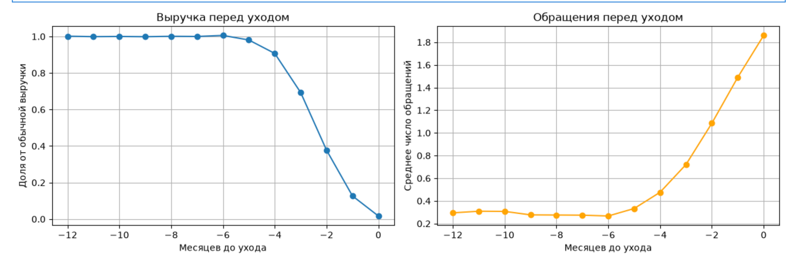

# Журнал EDA — неделя 1

## 4.1. Что является строкой в таблице

- `clients`: одна строка — один клиент.
- `usage`: одна строка — один клиент в одном месяце.

## 4.2. Ключ для связи таблиц

Таблицы связываются по `client_id`. Данные `usage` содержат помесячную историю клиентов. Название компании не является ключом, так как 19360 компаний приходится на 50400 клиентов и записи могут повторятсья.

Таблицы связываются по client_id.

## 4.3. Период данных

- `usage`: январь 2024 — июнь 2026, всего 30 месяцев, без пропусков.
- Даты подключения клиентов: июль 2021 — апрель 2026. всего 58 месяцев

## 4.4. Как увидеть отток

Доля явного оттока: **14 039 клиентов (27,86%)**.

- Явный отток определяется по заполненному `termination_date`.
- Тихий отток можно заметить по резкому падению `revenue`, `n_sim` и `traffic_gb` и не восстанавливается.

## 4.5. Количество клиентов по сегментам и продуктам

### Сегменты

| Сегмент | Клиентов |
|---|---:|
| `Малый бизнес `| 24 388 |
| `Средний бизнес` | 17 079 |
| `Крупный бизнес` | 8 933 |

### Продукты

| Продукт | Клиентов |
|---|---:|
| `Мобильная связь` | 12 676 |
| `Интернет` | 12 634 |
| `Телефония` | 12 627 |
| `Облачные сервисы` | 12 463 |

## 4.6. Дубликаты

- В `clients` нет полных дубликатов и повторений ключа `client_id`.
- В `usage` нет полных дубликатов и повторений составного ключа `client_id + month`.
- Повторение одного `client_id` в разные месяцы не является дубликатом.

## 4.7. Выбросы и аномалии

Отрицательных значений в числовых столбцах нет. Нулевых значений `revenue` нет.

| Столбец | Количество нулей |
|---|---:|
| `traffic_gb` | 835 |
| `n_tickets` | 812 097 |
| `debt` | 980 666 |
| `n_sim` | 37 417 |

Нули в `n_tickets` и `debt` нормальны. Нули в `traffic_gb` и `n_sim` могут зависеть от продукта или указывать на снижение активности. Крупные значения `revenue` принадлежат клиенту крупного бизнеса и не выглядят ошибочными. Явных аномалий не обнаружено.

## 5. Доля оттока

| Segment | Количество расторгнутых договоров | Процент |
| --- | --- | ---: |
|`крупный бизнес `| 1796 | 20.105228 |
|`средний бизнес`  |4713 | 27.595292 |
|`малый бизнес `  |7530 | 30.875841 |

| Region | Количество расторгнутых договоров | Процент|
| --- | --- | ---: |
| `Москва` |            2794 | 28.182368
|`Санкт-Петербург`  | 2787| 27.544969
|`Сибирь`            |2782| 27.363037
|`Урал`               |2791| 27.644612
|`Юг`                 |2885| 28.550223

| Product | Количество расторгнутых договоров | Процент|
| --- | --- | ---: |
|`интернет`            |3479 | 27.536805
|`мобильная связь`    | 3549 | 27.997791
|`облачные сервисы ` |  3485 | 27.962770
|`телефония` |           3526 | 27.924289

Доля явного оттока: **14 039 клиентов (27,86%)**.

Доля тихого оттока 995 клиентов (2.8% ).   
Тихим оттоком считается активный клиент, у которого средняя revenue и n_sim за апрель-июнь 2026 составляет менее 30% от уровня октябрь-декабрь 2025

### Дыры
Клиентов с дырами: 0  
min история        3.0 месяца. 
median    24.0. 
max история      30.0 месяца.  
Name: n_months_actual, dtype: float64. 
Клиентов у которых Полная история (30 месяцев): 19985. 

### Распределение 

По поводу распределения по датам подключения и расторжение:    
до февраля 2026 подключается примерно по 850-900 клиентов ежемесячно.   
в марте 2026 всего 28, в апреле 27. После апреля новых подключений нет.     
расторжения начались только с апреля 2024 года, в январе-марте расторжений не было.  

### **Находки**

В марте резко возрасло количество обращений в поддержку и упал трафик

### Выбросы
Найдено 21 906 строк, где n_sim = 0, но revenue > 1000. Это может быть особенность биллинга, либо противоречие в данных.

## 6. Графики динамики revenue для 5-10 ушедших и 5-10 оставшихся клиентов — визуально понять, как выглядит отток.
Выровнял ушедших не по календарю, а по числу месяцев до расторжения, поделил выручку каждого на его же норму примерно за год до ухода, взял медиану. Получилось 0,90 → 0,69 → 0,37 → 0,13, и тикеты в это же время растут с 0,27 до 1,86. У 65 процентов в последний месяц меньше десятой части от нормы. Из десяти картинок получилась одна, зато с цифрой.

### исходники (без форматирования нейронки)

4.1. клиент

4.2. client_id (pk\fk), склеивается по месяцам

4.3. 2021.07-2026.04, без дыр

4.4. (is_explicit_churn) 14039 = 0.278552 Доля которые явно расторгли договор
явные оттоки можно увидеть по termination_date которые явно расторгли договор
тихий отток можно увидеть по выручке по месяцам, если revenue, n_sim, traffic_gb резко падает и не восстанавливается

4.5. segment
малый бизнес      24388
средний бизнес    17079
крупный бизнес     8933
product
мобильная связь     12676
интернет            12634
телефония           12627
облачные сервисы    12463

4.6. clients[client_id] (по ключу) дубликатов нет, clients.duplicated() (вообщем строки) дубликатов нет. 
usage[client_id, month] дубликатов нет, usage.duplicated().sum() вообщем дубликатов тоже нет

4.7. отрицательных/нулевых revenue нет, отрицательных debt нет. traffic_gb < 0 тоже нет.
нули 
client_id          0
month              0
revenue            0
traffic_gb       835
n_tickets     812097
debt          980666
n_sim          37417
явных выбросов и аномалий нет, крупные revenue принадлежат одному клиенту крупному.